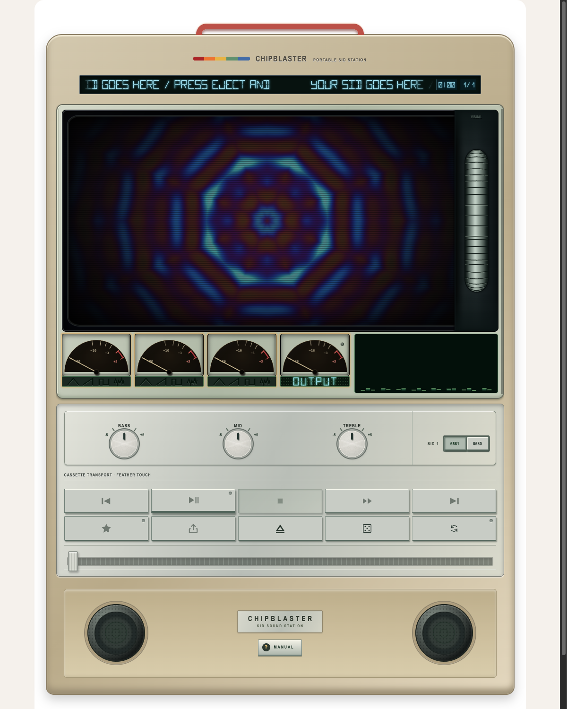
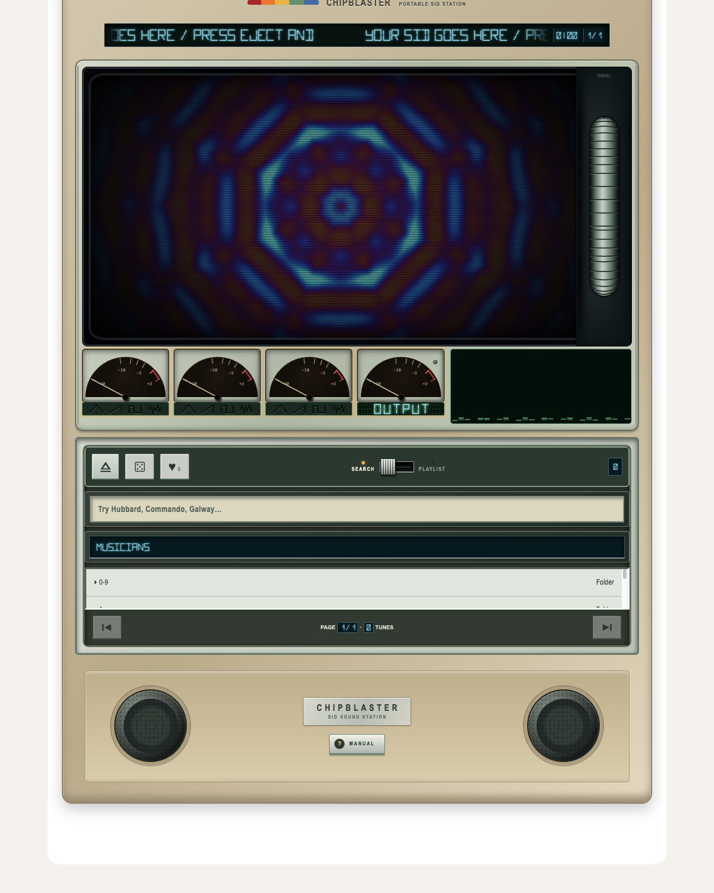
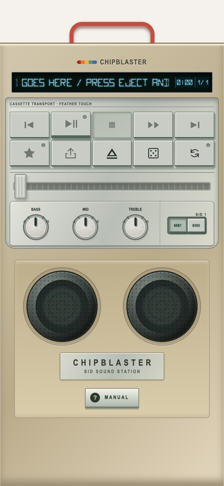
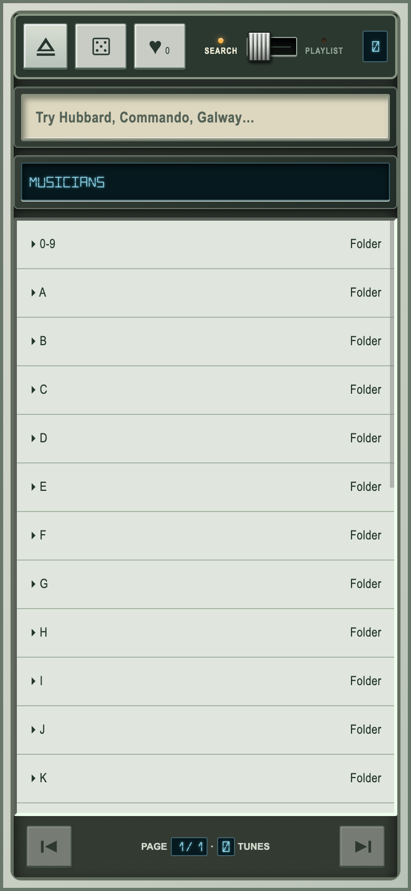

# CHIPBLASTER

A portable SID station in the browser: browse and play the High Voltage SID Collection (HVSC) through a hi-fi styled player.

**Live site**: https://chipblaster.sulopuis.to/ (mirror: https://ollisulopuisto.github.io/chipblaster/)

## Screenshots

| Desktop | Tune browser (control lid hinged open) |
| --- | --- |
|  |  |

| Phone (folded case) | Phone tune browser |
| --- | --- |
|  |  |

## Features

- Search a snapshot of the HVSC #85 catalog (June 2026), filter to saved tunes, queue tunes and build a playlist.
- Play PSID files with a lightweight JavaScript SID emulator; pick subtunes, switch SID 1 between 6581 and 8580 live, and choose 6581/8580/off for SID 2 on multi-SID tunes.
- Infinite play and the queue use catalog duration estimates (three minutes when unknown) as the longest a tune may play. A background worker also scans each SID for its loop (`src/sid-loop.ts`); when a whole loop fits inside that time, the tune fades out over four seconds and ends on the loop boundary. Tunes without a detectable loop end at the estimate. A dice key loads one random tune. Infinite play plays the queue first, then draws random tunes from what the browser shows when it is switched on: the search results, the star filter or the open folder.
- Three voice meters with waveform lamps (SID 1 amber, SID 2 cyan), a master meter, a frequency spectrum and audio-driven speaker cones.
- Two finishes share the same controls. The model wears the C64's colours and key names (RUN/STOP, CRSR, RESTORE, f1-f7). The first Osaka prototype, in brushed aluminium with the original legends (PLAY/PAUSE, STOP, SHARE, RANDOM), is a hidden extra. The manual hints at it; the way in is to click the name on the base plate, which wiggles once a minute and opens the scroller's `10 PRINT` prompt, and to type `LOAD"OSAKA"` there (the same command switches back). The choice is remembered in localStorage. In the style sheet, every C64 rule is scoped with `:not(.jp)`.
- LEVEL MATCH (on by default) evens out loud and quiet tunes (`src/leveler.ts`). It reads the tune's level before the tone controls, averages it, and moves the gain slowly toward about -18 dBFS RMS, within -9 to +6 dB. A soft limiter above 0.8 full scale catches peaks. The gain is saved per tune in localStorage; the key's tooltip shows the gain in use.
- Bass, mid and treble tone knobs with optional parametric frequency/Q (tap or click the knob's name, or right-click or long-press the knob; double-click resets), plus volume on `+` / `-`.
- WIDE knob for headphones: a mono-safe stereo widener on one-SID tunes, and a chip spread (SID 1 left, SID 2 right) on multi-SID tunes.
- The CRT visualizer imitates the C64's VIC-II: a 368x240 picture drawn at the C64's own size, with a border around a 320x200 window; a second pass stretches it to the tube so that the border keeps a fixed thickness on all four sides (8.5% of the shorter side) while the window takes the rest and its pixels may come out wider or taller than square, only the 16 Pepto colours, 8x8 character cells, 2x1 multicolour pixels, hardware sprites multiplexed in two bands (at most 8 per scanline), raster bars and border flashes on bass hits. Analogue CRT faults (line jitter, tracking glitches, colour bleed, hum bar, noise) are always on. The effects are in `src/c64-viz.ts`.

### Scroller text and the hidden BASIC prompt

The three scroller effects (DYCP scroller, Zoomscroll, Circle scroll) draw the C64 character-ROM letters and show the name of the tune and its author, followed by an optional message of your own (up to 256 characters). Several effects also take a seed from the tune (its HVSC path, or its title and author for local files): it shifts the phase, rotates the colour ramps and changes the sprite colours, so each tune gets its own look.

The message is an Easter egg. Press the quote key (Shift-2) anywhere on the page, or hold the CHIPBLASTER logo for a moment on a phone. The title display turns into a BASIC prompt, `10 PRINT "`, where you type the text; Enter keeps it (and remembers it in the browser), Esc cancels. The share link carries the message as `&m=...`, so whoever opens the link sees it in the scrollers.

### Visualizer effects and their sources

The CRT starts at the C64's BASIC prompt. Turning the thumbwheel (or pressing its arrow keys) reads the directory of effects from the built-in drive (`LOAD"$",8` and `LIST`) and shows it with the chosen effect in reverse video. When the wheel has rested for about 0.7 s, the player types a LOAD command for that effect, searches and loads it with a burst of border stripes, then types RUN and starts it. Scrolling again during the load returns to the directory. A link that names an effect (`?visual=`) skips the prompt on the first load.

Five effects follow the SID voices. Sprite multiplex and Balloons give each sprite one voice (SID 1 voices 1-3, SID 2 voices 4-6; one-SID tunes repeat the first three): the voice's level sets the sprite's size and bounce, and its waveform sets the shape (round without data, diamond for triangle, wedge for sawtooth, square for pulse, dithered disc for noise); on Balloons the waveform shows as a pattern. Scope draws one trace per voice, in that voice's own waveform. Stick dancer has one dancer per voice: the level sets the size and the sweep of the moves, a pulse wave snaps between poses, a sawtooth hops and noise shakes. Dot plotter splits its 96 dots between the three voices: level swells and enlarges them, pulse snaps the swell and noise makes them jitter. The levels come from the same pre-filter voice taps as the voice meters and are held at each effect's own frame rate. Each voice's pitch is read from its frequency register (SID 1 voices 1-3, SID 2 voices 4-6) and drives more: the Scope trace oscillates at the note's own rate, Sprite multiplex sprites rise and fall with the pitch, and the Stick dancer lifts its arms for high notes. Piano roll is an effect of its own: each voice scrolls a trail of its pitch to the left (up is higher, thicker is louder, the waveform sets the texture). Every effect except Open borders also gets a small meter per voice in the top and bottom border. Where a voice has no pitch or level data (the jsSID fallback has no pitch), the effects fall back to the three frequency bands.

The thumbwheel cycles 26 effects built after the demoscene's best-rated C64 productions (ranking from CSDb, 2026). They are my own GLSL imitations running under the C64's limits (16 Pepto colours, 8x8 cells, sprite limits, per-effect frame rates), not ports of the original code:

- Edge of Disgrace (Booze Design): chess zoomer with sprites, AFLI double-sine plasma, dot plotter morphing between sphere, torus and heart.
- Coma Light 13 (Oxyron): parallax hills and floor, flat-shaded cube with a real-time shadow.
- Uncensored (Booze Design): 360-degree rotating raster bars, zoomscroll through all borders.
- Comaland (Censor Design, Oxyron): vector stick figure.
- Next Level (Performers): noise fader.
- Viva Las Vegas (Censor Design): Chips DNA helix, circle scroll.
- The Hat (Fairlight, Genesis Project): balloon sprites.
- The classics: raster bars, sprite multiplexing, char plasma, rotozoomer, tunnel, open borders, DYCP, FLD, FLI and linecrunch.
- Cycle visualizer presets with the thumbwheel; fold the case to hide the visualizer while music keeps playing.
- Share a link to the current tune, and save favorites in this browser.
- An in-app manual (MANUAL key on the base plate) lists the controls and shortcuts.

Keyboard: `Space` play/pause, `S` stop, `←`/`→` previous/next song, `+`/`-` volume, `F` favorite, `E` eject (open the browser), `[` `]` previous/next subtune, `1` saved tunes, `2`–`4` catalog browser. Shortcuts pause while typing.

## Run locally

Node 22.12 or newer:

```
npm ci
npm run dev       # dev server, URL printed by Vite
npm run build     # production build in dist/
npm run preview   # serve the build
```

No server component is needed. The player fetches individual SID files from the Modland HVSC mirror, so the mirror must be reachable and allow browser (CORS) access. Recently played tunes are cached in the browser (up to 100 entries, subject to storage limits). Favorites and cached tunes stay local to each browser and origin; they do not sync between devices or domains.

## Deployment

`.github/workflows/pages.yml` type-checks, builds and deploys to GitHub Pages on every push to `main` (pull requests build only). The site is served from the custom domain `chipblaster.sulopuis.to` (`public/CNAME`) and works from a repository path or a domain root, since Vite uses relative asset paths.

## Limitations

- SID only. There is no local file picker, drag-and-drop or audio export.
- The emulator is lightweight: RSID tunes need full C64 emulation, and some digi effects or unusual players may sound different.
- The catalog is a snapshot, not a live index; the mirror can lag or be unavailable.

## Sources and rights

The UI code in `src/App.tsx` and `src/style.css` was written for this project. Bundled third-party code: Hermit's jsSID emulator (`src/vendor/hermit-jsSID.js`, permissive use with credit: https://github.com/og2t/jsSID/blob/master/README.txt), and 16-segment glyphs based on David Madison's MIT-licensed [LED-Segment-ASCII](https://github.com/dmadison/LED-Segment-ASCII) (`src/vendor/LED-SEGMENT-ASCII-LICENSE.txt`). This repository makes no blanket license claim over third-party code or the HVSC metadata.

Credits, as listed in the in-app manual: libsidplayfp (Simon White's sidplay2, Antti Lankila, Leandro Nini and contributors; GPL-2.0-or-later) with SIDLite (Leandro Nini) and reSIDfp (Dag Lem, Antti Lankila, Ken Händel and Leandro Nini, after Dag Lem's reSID), built for the web by [libsidplayfp-wasm](https://github.com/chrisgleissner/libsidplayfp-wasm) (Chris Gleissner); jsSID by Hermit (Mihaly Horvath); the Silkscreen pixel font (SIL OFL, `src/fonts/OFL.txt`); the HVSC catalog served from the Modland mirror; the demoscene productions listed under the visualizer effects, found through CSDb; and the VIC-II palette as measured by Pepto.

HVSC tunes are copyrighted and are not included; see https://hvsc.c64.org/download/C64Music/DOCUMENTS/HVSC.txt. This is an independent fan project, not affiliated with HVSC or the library authors.

## Last.fm scrobbling (optional)

The LAST.FM key on the bottom plate links the player to a Last.fm account. While linked, a tune is sent as "now playing" when it starts and scrobbled after half its length or four minutes (tunes under 30 seconds are skipped). Artists lose a trailing scene handle: "Marcin Majdzik (Psycho)" becomes "Marcin Majdzik". Scrobbles that cannot be sent wait in the browser and go out later. Each person links their own account in their own browser; the session key never leaves it.

Last.fm signs every write call with a shared secret, so a small Cloudflare Worker (`worker/lastfm-signer`) does the signing and the secret never reaches the page. To switch it on:

1. Create an API account at https://www.last.fm/api/account/create. Note the API key and the shared secret.
2. Deploy the Worker (see `worker/lastfm-signer/README.md`): put the API key and the site origin in `wrangler.toml`, store the secret with `npx wrangler secret put LASTFM_SECRET`, run `npx wrangler deploy`.
3. In the GitHub repository settings add two variables (Settings, Secrets and variables, Actions, Variables): `LASTFM_API_KEY` and `LASTFM_SIGNER_URL` (the Worker URL, without a trailing slash).
4. Build as usual. Without the variables the LAST.FM key is hidden.

For local testing put `VITE_LASTFM_API_KEY` and `VITE_LASTFM_SIGNER` in `.env.local`.

## SID engines

The default sound comes from libsidplayfp's SIDLite (WebAssembly, GPL-2.0-or-later, `libsidplayfp-wasm`), shown as LITE in the status window. The ENHANCED key in the OPTION hatch switches to reSIDfp (RESID), the emulation closest to the real chip and several times heavier. The choice is remembered. If an engine cannot start, or the sound runs out repeatedly because the device is too slow, the player steps down on its own: RESID to LITE, and LITE to the original jsSID (JS). The status window always shows which engine is playing.

`?engine=js`, `?engine=sidlite` and `?engine=residfp` force an engine without remembering it, and `?debug` shows a readout of the engine and its load.

The engine renders in a Web Worker (`src/fp-worker.ts`) and streams PCM to a small AudioWorklet (`src/fp-sink-worklet.js`); `src/fp-player.ts` presents the same surface as the jsSID player. Voice meters and STEREO ENHANCE come from a jsSID core that plays the same tune alongside in the worker, because libsidplayfp gives only the mixed sound. The meters follow the tune, not the exact sound of the engine, and the width effect is the same signal added to libsidplayfp's mix. Tape speed is a resampler in the sink and is identical for all engines. Multi-SID tunes use libsidplayfp's own chip placement. RSID tunes that need C64 ROM images do not play, as the ROMs are not bundled.

## Control hatch and video standard

MANUAL, CLICK, ENHANCED and LAST.FM sit under a CONTROL hatch below the speaker. Press the hatch: it dips in, swings up and vanishes. The slim tab under the keys closes it. The hatch state is remembered. The status window in the title display shows PAL or NTSC from the tune's header (when the header does not say, neither lights and PAL is used) and, on the row below, the SID engine in use: JS, LITE or RESID. The sub-tune counter is hidden when a tune has only one. The display itself is not interactive: sub-tunes are stepped with the SUBTUNE keys in the transport heading (or `[` and `]`).
